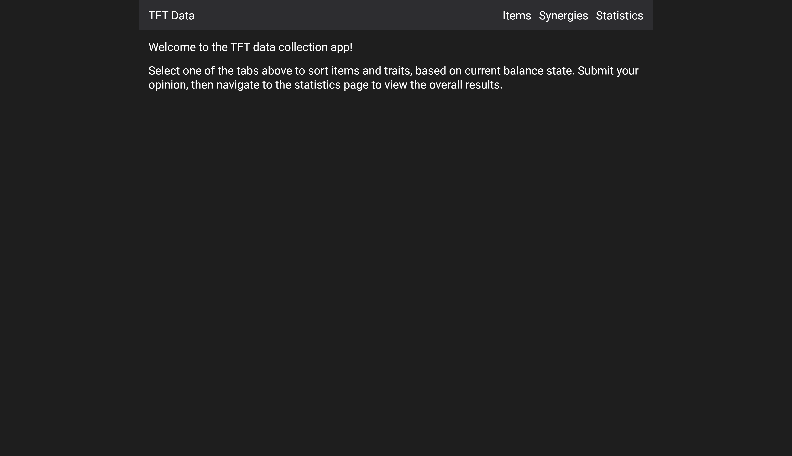
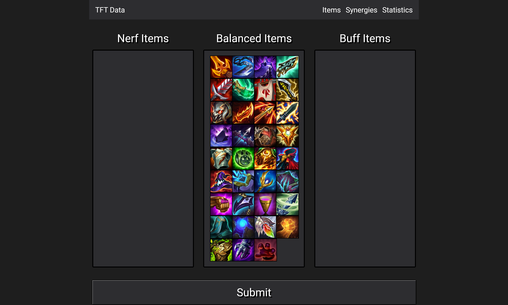
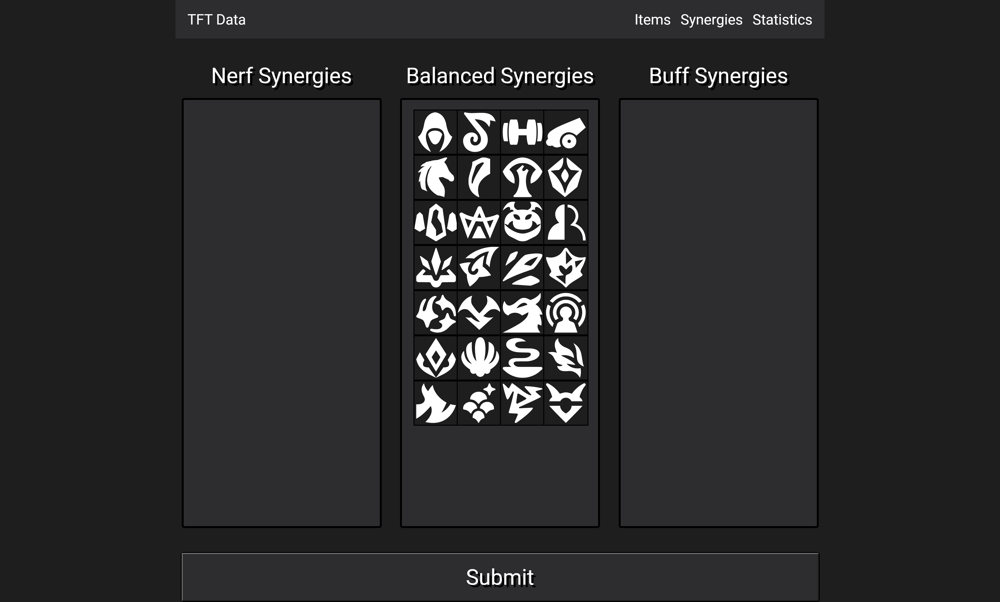

# TFT-Data-Tracker

## Link

## Description
The purpose of this project is to design a Full-Stack MERN application, where users can organize and submit balance data for the popular game Team Fight Tactics.  This application will feature three main pages, labelled as items, synergies, and statistics.  On the items and synergies page, users will be able to sort each element as weak, neutral, or too strong.  The results can then be submitted, and the overall data on the statistics page will be updated.

## Steps Taken

1.  Created a basic Front-End in React, made up of pages and their respective components

2.  Imported and set up DnD-Kit to enable drag and drop elements

3.  Created a basic Back-End, including models, resolvers, and type defs

4.  Tested all queries and mutations on Apollo GraphQL

5.  Created and connected queries and mutations on front-end

6.  Tested each feature of application and fixed any bugs  

## Pictures

### Home Page

### Items Page

### Synergies Page

### Statistics Page
